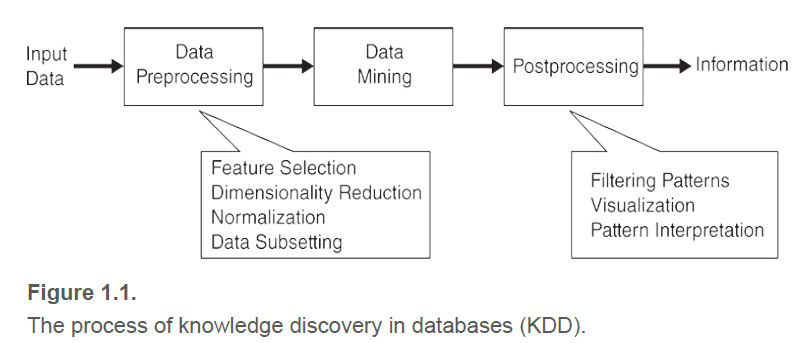

# 1.1 什么是数据挖掘？

有很多定义：

- Non-trivial extraction of implicit, previously unknown and potentially useful information from data
- Exploration & analysis, by automatic or semi-automatic means, of large quantities of data in order to discover  meaningful patterns 

> Data mining is the process of automatically discovering useful information in
> large data repositories.

总的来说，**数据挖掘是在大型数据仓库中自动发现有用信息的过程。**数据挖掘技术被用于搜索大型数据集，以找到新的和有用的模式。它还可以预测未来的观察结果，比如客户将在网上或实体店消费的金额。

<!-- more -->

但并不是所有的信息发现任务都是数据挖掘。例如**信息检索**（information retrieval），包括在数据库中查询记录，搜索相关网站。数据挖掘技术可以用于增强信息检索系统的能力。

## 数据挖掘和知识发现

> Data mining is an integral part of knowledge discovery in databases (KDD), which is the overall process of converting raw data into useful information

数据挖掘是数据库知识发现(knowledge discovery in database, KDD)的重要组成部分，KDD是将未加工的数据转换为有用信息的整个过程。

- 输入数据可以以各种格式存储(平面文件、电子表格或关系表)，可以存储在集中式数据存储库中，也可以分布在多个站点上。
- **数据预处理的目的是将原始输入数据转换为适合后续分析的格式**。数据预处理（Data Preprocessing）的步骤包括融合多源数据、清理数据以去除噪声和重复的观测值、选择与当前数据挖掘任务相关的记录和特征。

- “结束闭环”（Closing the loop）,指的是将数据挖掘结果集成到决策支持系统的过程。例如，在商业应用中，数据挖掘的结果所揭示的规律可以结合商业活动管理工具，从而开展或测试有效的商品促销活动。这种结合就需要后处理（Postprocessing），以确保只有有效和有用的结果被纳入决策支持系统。后处理的一个例子是可视化，它使得数据分析者可以从各种不同的视角探查数据和数据挖掘结果。

虽然数据挖掘传统上被视为KDD框架中的中间过程，但多年来它已经成为计算机科学中的一个学术领域，关注于KDD的所有方面，包括数据预处理、挖掘和后处理。

