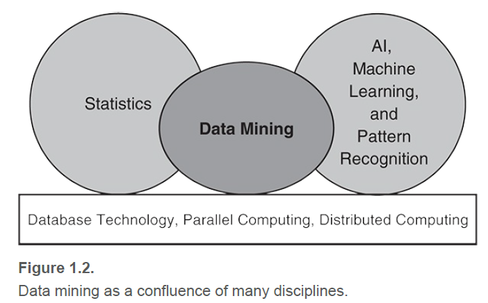

## 数据挖掘的起源

从机器学习/人工智能、模式识别、统计和数据库系统中汲取思想。

传统的技术可能不适合，由于当今数据具有如下特点

- Large-scale
- High dimensional
- Heterogeneous
- Complex
- Distributed

<!-- more -->

数据挖掘是数据科学和数据驱动发现的新兴领域的关键组成部分。数据驱动方法成功的一个例子就是深度学习。

下图是数据挖掘与其他领域的关系

