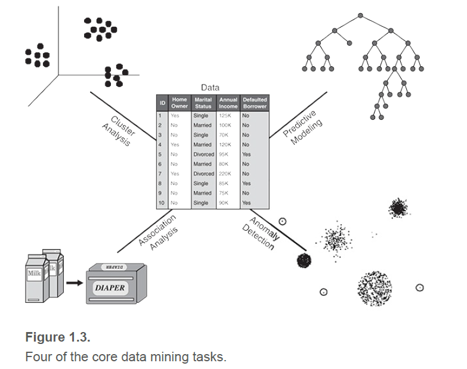

# 数据挖掘的任务

数据挖掘任务一般分为两大类:

- 预测任务(Predictive tasks)
  - 这些任务的目的是根据其他属性的值预测特定属性的值。被预测的属性一般称为**目标变量(target)**或因变量**(dependent variable)**，用来进行预测的属性称为**说明变量(explanatory)**或**自变量(independent variables)**。
- 描述任务(Descriptive tasks)
  - 这里的目标是导出概括数据中潜在联系的模式(相关性、趋势、聚类、轨迹和异常)。描述性数据挖掘任务在本质上通常是探查性的，并且经常需要后处理技术来验证和解释结果。

<!-- more -->

图1.3说明了数据挖掘的四个核心任务，**可结合吴恩达的机器学习课程理解**，如下所用例子该课程均有讲解。

- **预测建模（Predictive Modeling）涉及以说明变量函数的方式为目标变量建立模型。**有两种类型的预测建模任务：分类和回归。
  - **分类**（classification），**用于离散目标变量。**例如预测用户是否会网上购物，因为其目标变量只有两个值（是或否）。书这里同样举了对鸢尾花（例子1.1）进行分类的例子。
  - **回归**（regression），**用于连续目标变量。**例如预测未来一段时间内的股票的价格，因为股票价格是连续的属性。
  - **这两个任务的目标是训练一个模型，使目标变量的预测值和实际值之间的误差达到最小。**预测建模可用于确定顾客对产品促销活动的反映，预测地球生态系统的扰动，或根据医学检查的结果判断病人是否患有某种疾病。
- **关联分析**（Association Analysis）**用于发现描述数据中强关联特征的模式**。所发现的模式通常用蕴含规则或特征子集的形式表示。由于关联分析的搜索空间是指数级的，所以它的目标是以一种有效的方式提取出最有趣的模式。关联分析的应用包括发现具有相关功能的基因组，确定可以一起访问的网页，或者了解地球气候系统中不同元素之间的关系。
  - 例子1.2：购物车分析。通过对收银台收集的销售数据进行关联分析可以找到顾客经常一起购买的物品，例如，购买尿布的顾客也倾向于购买牛奶。这种类型的规则可以用来识别相关产品之间潜在的交叉销售机会。
- **聚类分析（Cluster analysis）旨在发现紧密相关的观测值组群，使得与属于不同簇的观测值相比，属于同一簇的观测值之间尽可能类似。**聚类可用于对相关顾客进行分组，找到对地球气候有重大影响的海洋区域以及压缩数据等。
  - 例子1.3：文档聚类。根据文章中出现关键词的频度来进行对其分类。
- **异常检测（Anomaly Detection）是识别其特征与其他数据显著不同的观测值。这样的观测值被称为异常点（anomaly）或离群点（outlier）。**异常检测算法的目标是发现真正的异常点，避免错误地将正常对象标记为异常。即，一个好的异常检测器必须具有高检测率和低误报率。异常检测的应用包括检测欺诈、网络攻击、疾病的不寻常模式和生态系统扰动，如干旱、洪水、火灾、飓风等。
  - 例子1.4：信用卡欺诈检测。由于欺诈案件的数量相对于合法交易的数量相对较少，可以应用异常检测技术为用户建立合法交易的轮廓。当新交易产生时就将其进行比较。如果交易的特征与之前构造的轮廓不同，那么该交易将被标记为可能欺诈。

