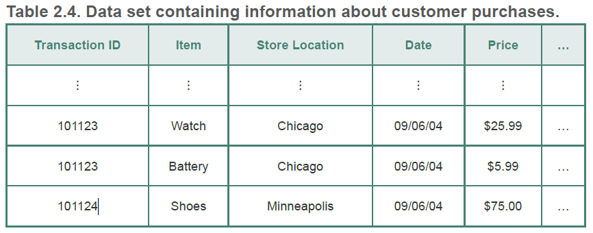

# 2.3.1 聚集

聚集（Aggregation）就是将两个或多个对象合并成单个对象。例如一个记录了不同地区的各个商店每日的交易信息，如图2.4，可以将其按照地区进行聚集。这样可以减少每日每个商店的单个交易记录。

聚集时的一些属性值需要改变。定量（Quantitative）的一些属性，例如价格可以是求总和或者平均值进行聚集。定性的属性（qualitative），例如商品名称可以忽略或汇总为一个大类，比如电视机归为家电类。

表2.4也可以看做是一个多维数组，每一个属性都是一个维。从这方面来看，聚集是一个删除属性的过程，或者是压缩特定属性不同值个数的过程。例如物品名称归为大类，时间记录从每天归为每月。这用聚集方法通常用于联机分析处理（Online Analytical Processing，OLAP）技术。

以下为使用聚集的动机。

1. 数据规约导致的较小数据集可以减少内存和处理时间等的花销。也因此一些开销较大的算法的使用也成为了可能。
2. 通过高层而不是底层数据视图，聚集起了范围或标度转换的作用。上面例子中的将每个商店位置聚集为地区，将每日数据归为每月，将商品归为大类等操作。
3. 对象或属性群的行为通常比单个对象或属性的行为更加稳定。这反映了统计学的事实：相对于被聚集的单个对象，诸如平均值、总数等聚集量具有较小的变异性。对于总数，实际变差大于单个对象的（平均）变差，但是变差的百分比较小；对于均值，实际变差小于单个对象的（平均）变差。

聚合的缺点就是可能会丢失一些有用的细节。上例中，将每日数据聚合为每月，将无法估计每周哪天的销量最好。

