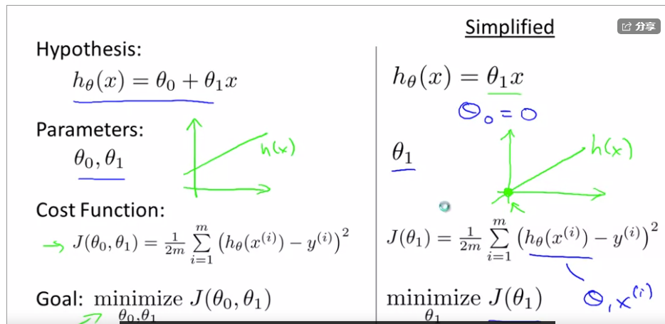
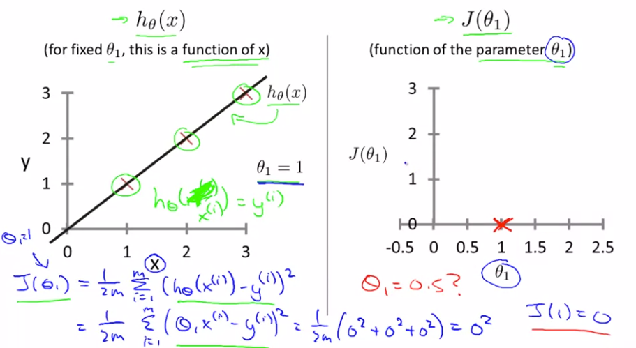
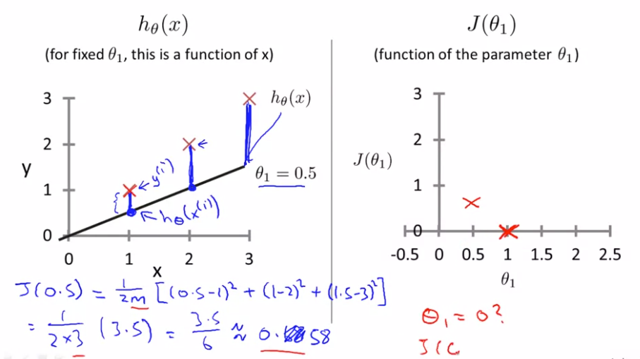
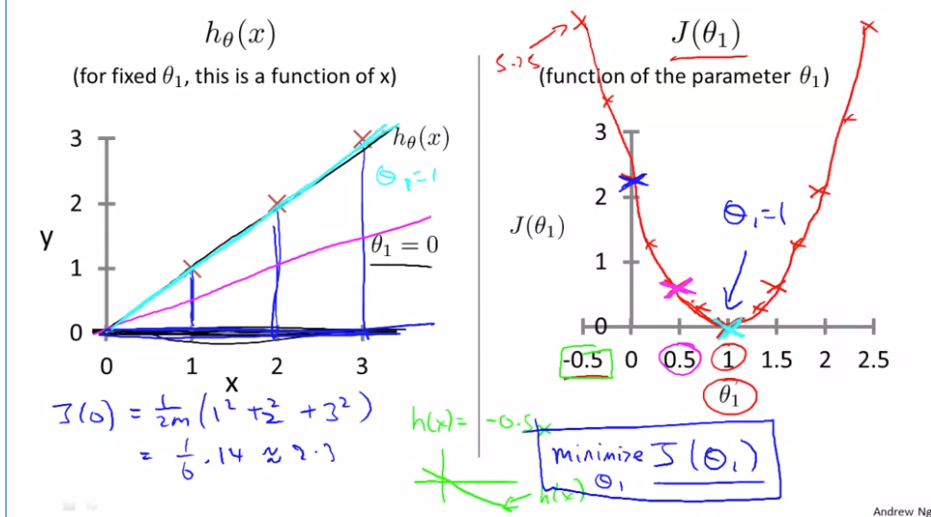

用简化后的算法，即让这个函数只有一个参数$\theta_1$,即设定$\theta_0=0$来理解代价函数。

这是我们上次所讲过的内容，我们想找一条直线来拟合我们的数据，所以我们用$\theta_0$$\theta_1$

等参数得到了假设，而且通过选择不同的参数，我们会得到不同的直线拟合。

通过利用简化的假设得到的代价函数，我们可以试着更好地理解代价函数这个概念，我们要理解的是这两个重要的函数代价函数和假设函数

$h_\theta(x)$和$J(\theta_1)$,$h_\theta(x)$这个函数是假设函数，对于固定的$\theta_1$,这是一个关于x的函数，假设函数就是一个关于x（房子大小）的函数，与此不同的是代价函数J是关于一个$\theta_1$的函数

- 假设函数比如样本为(1,1)(2,2)(3,3),选择$\theta_1$等于1，则图像如下左图。这时当$\theta_1$等于1时$J(\theta_1)$等于多少？

- 假设$\theta_1=0.5$,则假设函数如下左图，$J(\theta_1)=0.58$

- 假设$\theta_1=0$，则假设函数如下左图,$J(\theta_1)=14/6$

对于任意一个$\theta_1$的取值，我们会得到一个不同的$J(\theta_1)$,而且我们可以利用这些来描出右边的这条曲线。学习算法的优化目标是找到一个$\theta_1$的值，来使$J(\theta_1)$最小化。对于上图$J(\theta_1)$最小化的值对应的$\theta_1=1$，这个就确实对应着最佳的通过了数据点的拟合直线。对于这个样本，我们最后能够完美地拟合。这就是为什么最小化$J(\theta_1)$对应着寻找一个最佳拟合直线的目标

