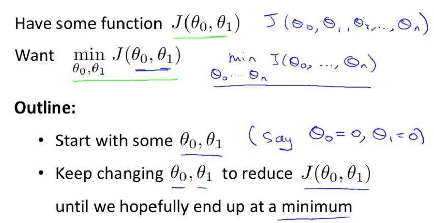
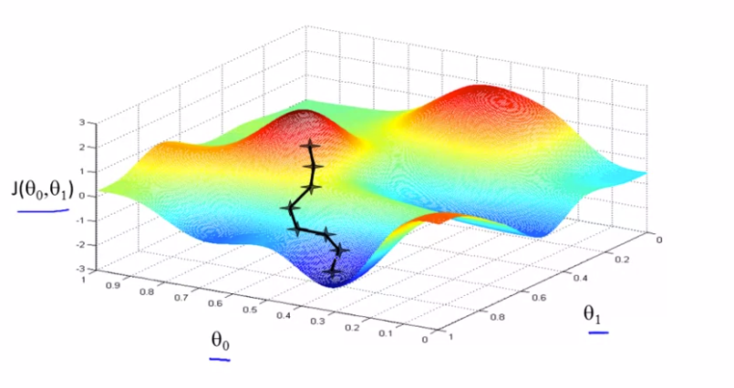
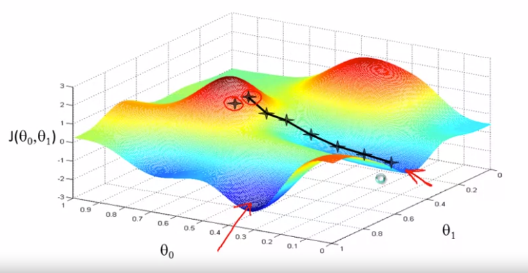

## 梯度下降算法

这是一种常见的算法，不仅仅用在线性回归问题上，也被用在机器学习领域中的众多领域。

本节用梯度下降算法最小化函数$J$

问题概述：

<!--more -->

梯度下降算法所求的是局部最小值。

为了简化问题，使用两个参数。想象一下自己在山上，想要下山，然后你环顾四周，选择从什么方向将会最快下山。然后一步一步以此类推。得到如下图。

如果从不同的位置进行初始化会得到不同的路线，从而得到不同的局部最优解

梯度下降算法定义：

$\alpha$称为学习速率，它控制我们以多大幅度更新这个参数$\theta_j$.它控制了我们下山时会迈出多大的步子。因此如果$\alpha$值很大，那么相应的梯度下降过程中，我们会试图用大步子下山。如果很小则用小碎步下山。在梯度下降算法中我们要**同时更新$\theta_0$和$\theta_1$,**当j=0和j=1时，会产生更新。