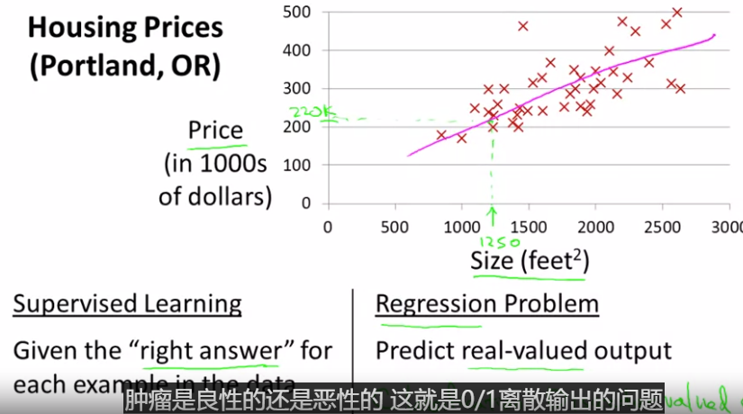
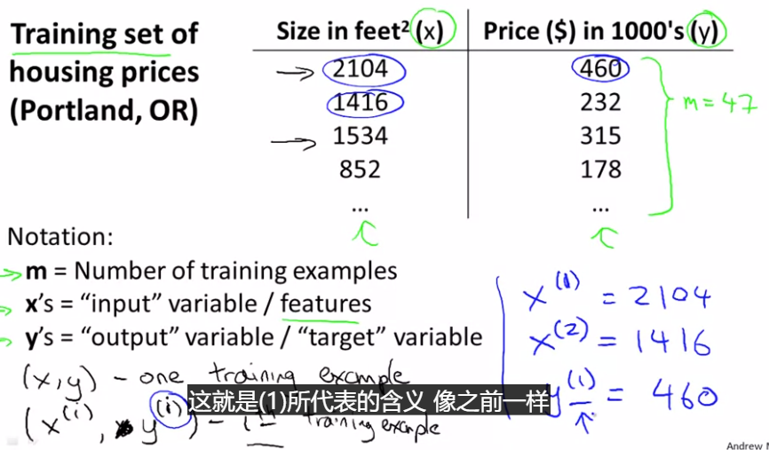
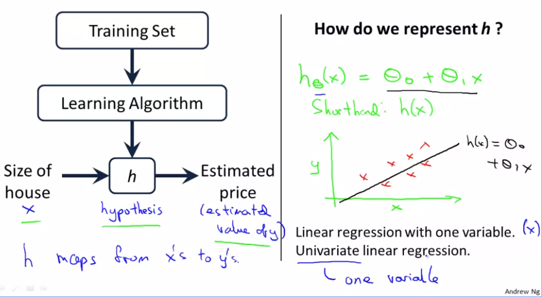

## 单变量线性回归Linear regression with one variable

本节学习整个监督学习的流程<!--more -->

监督学习中我们有一个数据集，这个数据集被称为训练集。对于预测房价的例子，我们有一个训练集，包含不同的房屋价格。我们的任务就是从数据集中学习预测房屋的价格。

训练集里的房屋价格，喂给我们的学习算法，然后输出一个函数（h）。hypothesis是从x到y的一个映射函数

