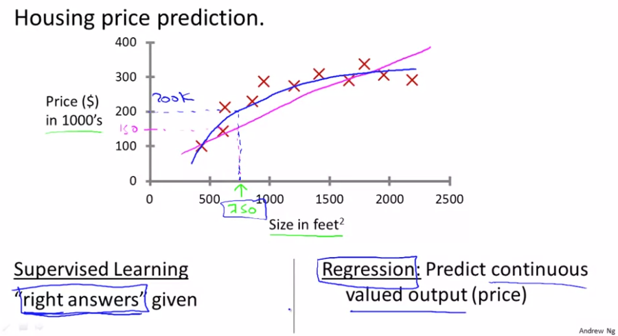
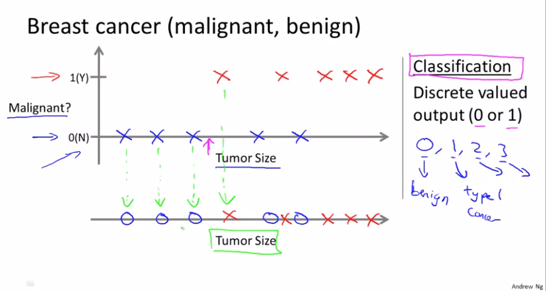
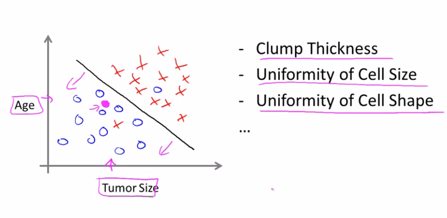

# Supervised Learning

## 监督学习

监督学习：给定已知正确输出结果(以属性或者标签进行标识)的数据集，让机器通过算法学习知道输入和输出之间的关系。

监督学习问题有两大类：<!--more -->

- 回归问题：试图在连续输出中预测结果，这意味着我们试图将输入变量映射到某个连续函数

  - 例子：预测房价

    

    

- 分类问题：试图以离散输出预测结果，我们试图将输入变量映射到离散的类别中

  - 预测癌症

    

    

### 测验

问题一：预测公司接下来三个月的商品销售量（回归问题）

问题二：预测用户账户是否被黑客攻击过（分类问题）

