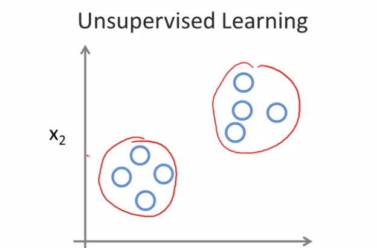
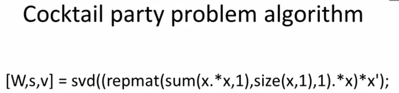

与监督学习相比，无监督学习的数据没有属性或者标签，即给定的数据集都是一样的。我们不知道每个数据是什么意义。让机器在从数据集中找到某种结构，对于无监督学习，没有基于预测结果的反馈。

即：只告诉算法，你看这有一堆数据，我不知道这些数据是什么东东，不知道里面有什么类型，叫什么名字。请问你可以自动的找到这些数据的类型吗？然后自动的按照类型将这些个体分类。因为**对于这些数据样本来说，我们没有给算法一个正确答案，所以这就是无监督学习。**<!--more -->

- 聚类算法：将数据集分类

  - 谷歌新闻：搜索成千万条新闻，然后自动的将他们聚合在一起，使有关同一主题新闻的放在一起
  - 通过基因序列的特征将人分类
  - 被用来组织大型的计算机集群，试图找出哪些机器趋向于协同工作，如果把这些机器放在一起可以让数据中心更高效地工作
  - 社交网络分析：联系人分类
  - 客户市场细分，将不同的客户细分到市场中，从而进行有效的销售。我们有客户数据但预先不知道有哪些细分市场，并且不知道谁属于哪个细分的市场
  - 天文数据分析

- 非聚类算法：鸡尾酒会算法。在混乱的环境中查找结构（从[鸡尾酒会]上的一系列声音中识别出个人的声音和音乐）

  - 

使用Octave环境或matlab，可以用几行代码实现一些算法

先用Octave写出一个程序原型，确定该算法可以工作后，移植到C++或Java等其他编译环境，svd()解线性方程函数