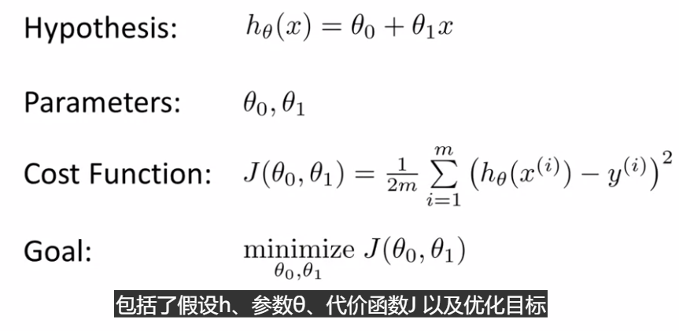
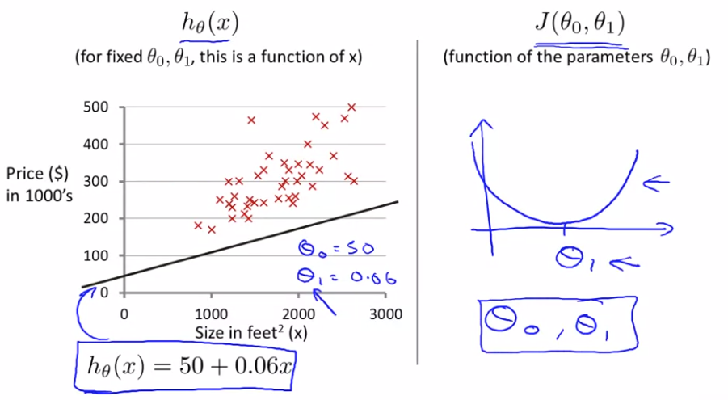
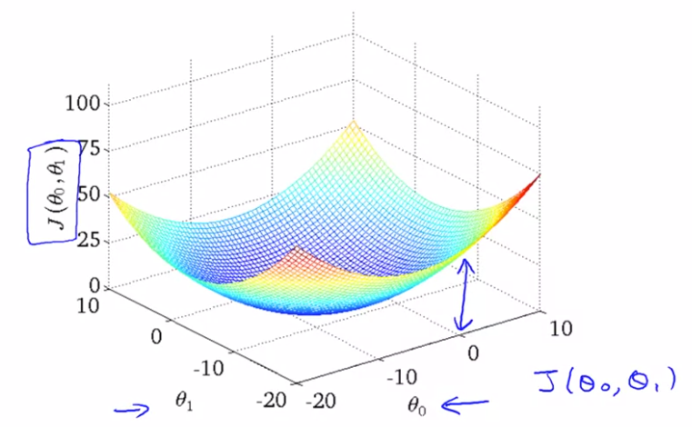
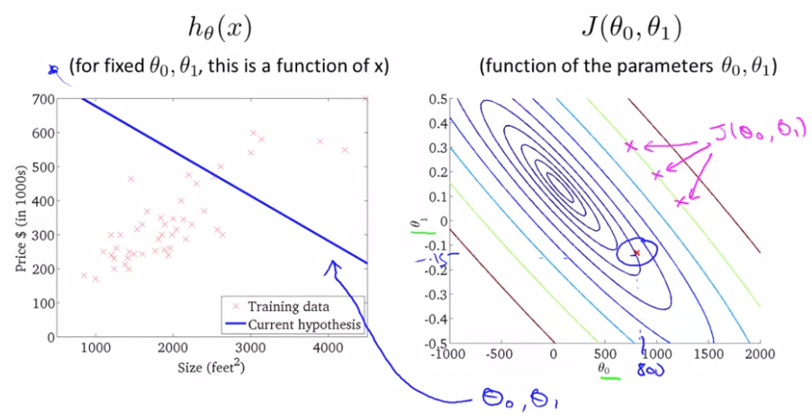
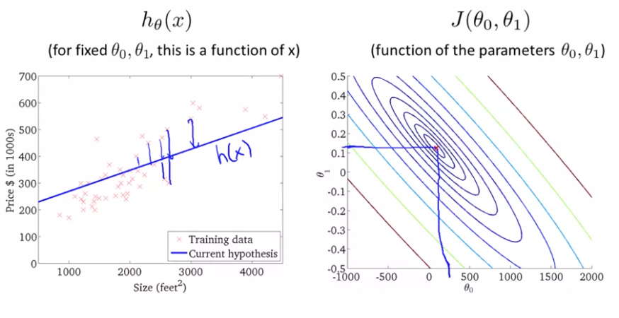

深入学习代价函数的作用。理解代价函数$J$所表达的值，它们是什么样的，它们对应的假设是什么样的。以及什么样的假设对应的点更接近代价函数$J$的最小值

二元参数的代价函数的三维表示图：

用上述三维图像用二维的轮廓图表示后：

显然最后一个图拟合度更好。

我们真正需要的是一种有效的算法，能够自动地找出这些使代价函数$J$取最小值的参数$\theta_0$和$\theta_1$来。后续会遇到更复杂的、更高维度、更多参数的情况，这些情况很难画出图像来将其可视化。我们真正需要的是编写程序来找出这些最小化代价函数的$\theta_0$和$\theta_1$的值。下节将介绍一种算法能够自动地找出能使代价函数$J$最小化的参数$\theta_0$和$\theta_1$的值。