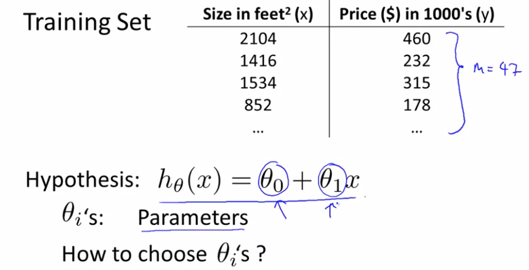
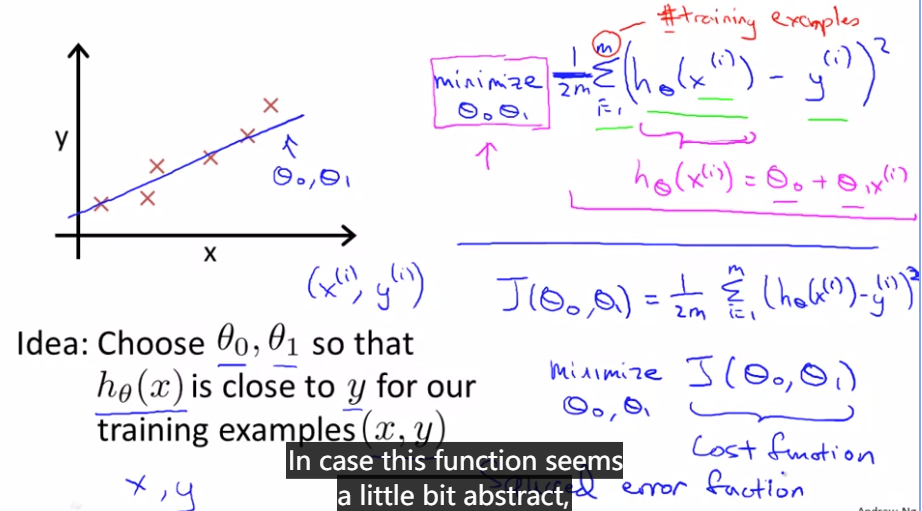

本节定义代价函数的数学定义即概念，弄清楚如何把最有可能的直线与我们的数据相拟合

在**线性回归**中我们有一个训练集，可能就像上面绘制的，我们要做的就是得出$\Theta_0 ，\Theta_1$ 这两个参数的值，来让假设函数所表示的直线尽可能与数据集吻合。如何得出$\Theta_0$和$\Theta_1$呢?

我们要做的事情是尽量减少假设的输出与房子真实价格之间差的平方。代价函数也被称为平方误差成本函数

