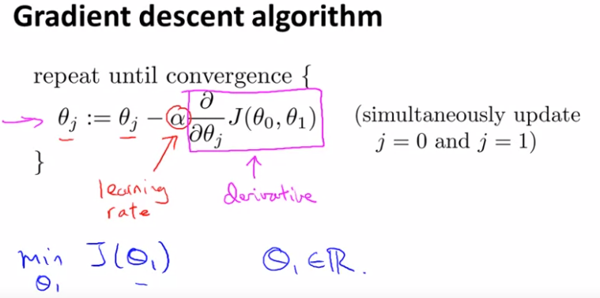
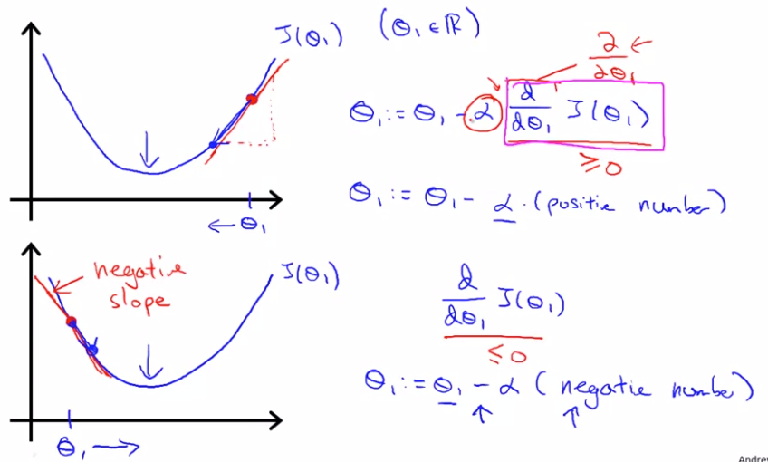
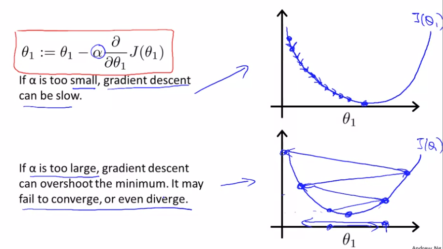
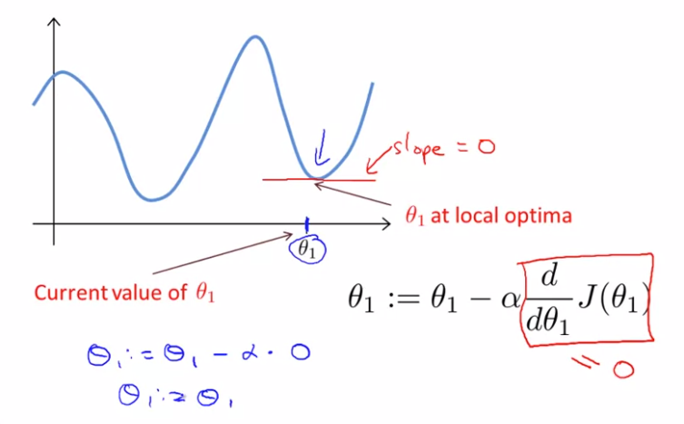
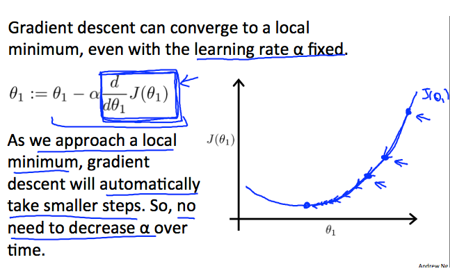

线性回归算法

在梯度下降中，当我们接近一个局部的最小值的过程里，梯度下降算法会自动采取越来越小的步子。这是因为当我我们接近局部最优时，其定义就是导数等于0。因此当我们接近局部最优，导数项会自动变小，所以梯度下降会自动采取更小的步子，这就是不需要减小$\alpha$或时间的原因。梯度下降算法，可以用它来最小化任何成本函数J,而不是我们为线性回归定义的那个成本函数J

$\theta_1:=\theta_1-\alpha \frac{d}{d\theta_1} J(\theta_1)$

